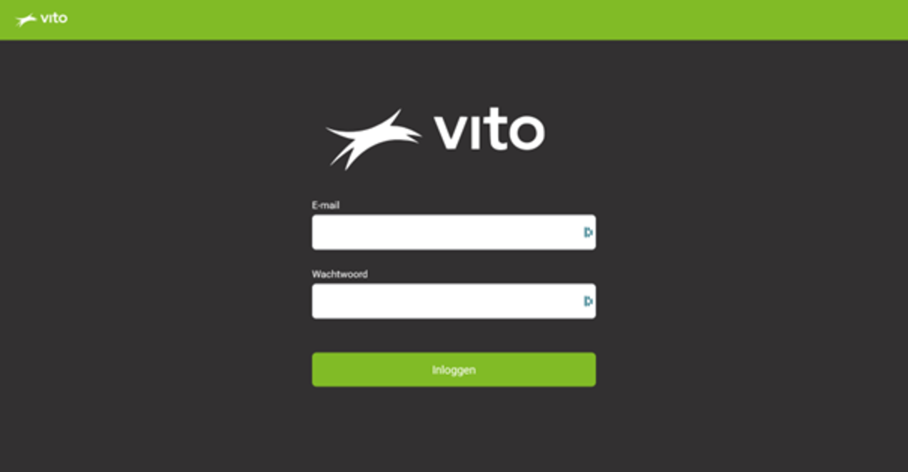
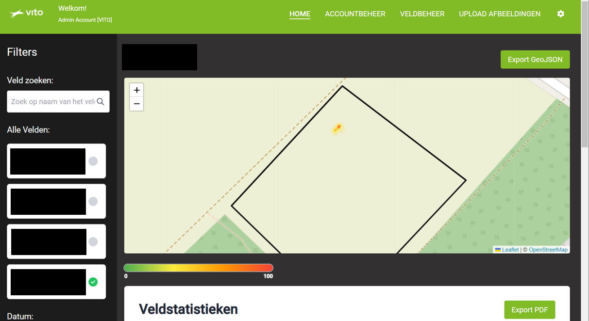
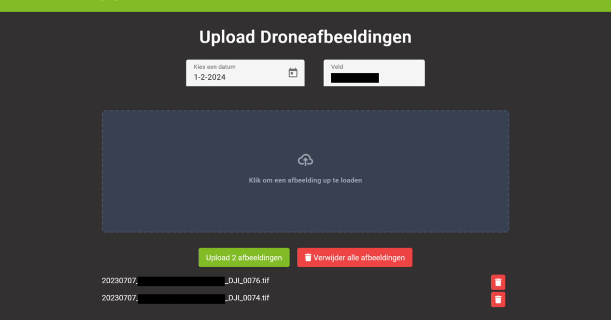

Below is some extra explanation for all the features implemented in the project. Due to privacy policies I had to censor certain information on the screenshots.

1. **Login screen**  
     
   This login screen has an underlying authentication API I built in `Python`.

2. **Home page**  
   
   On the home page farmers can select one of their properties and since there will be multiple drone imaging on different dates the farmer can also select a date, this is useful to check if weeds are expanding or reducing (meaning weed control is taking effect).
   Once selected, the property will be displayed on the map. On this map there are markers that display the location of weeds that our AI model found on the property. Below the map are different statistics that show the overall property health.

3. **Uploading drone images**  
   
   Once drone images are taken the user has to upload them, first they have to select the field for which the images were taken and the date on which the images were taken.
   Now the user can select files on their device that they want to upload, this is limited to only accept `.tiff` files (since this is the format of the drone images). Once all images are selected the user has to upload them and this will send them straight to our AI model.
   This will now analyze each image and upload its observations to the database.
